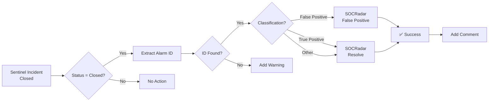

# SOCRadar - Azure Sentinel Automatic Integration

[](https://portal.azure.com/#create/Microsoft.Template/uri/https%3A%2F%2Fraw.githubusercontent.com%2Forcunsami%2Fazure-bidirectional-incident-app-fork-orcun%2Fmain%2Fsocradar-sentinel-integration-arm.json)

## 🎯 What Does It Do?

This Logic App automatically **closes the corresponding alarm in SOCRadar platform** when an **incident is closed in Azure Sentinel**.

### ✨ Features

- ✅ **One-click deployment** - Setup in 2 minutes with Deploy to Azure button
- ✅ **Bi-directional synchronization** - Sentinel ↔ SOCRadar
- ✅ **Smart closure** - Distinguishes between False Positive and True Positive
- ✅ **Automatic comments** - Logs actions in both platforms
- ✅ **Error handling** - Alerts when information is missing

---

## 🚀 Quick Start (3 Steps)

### 1️⃣ Deploy

**Click the "Deploy to Azure" button above** or use the following command:

```bash
az deployment group create \
  --resource-group YOUR-RG \
  --template-file socradar-sentinel-integration.json \
  --parameters SOCRadarAPIKey="YOUR_API_KEY"
```

### 2️⃣ Authorize

After deployment completes:

1. Azure Portal → Logic Apps → "SOCRadar-CloseAlarm-OnIncidentClose"
2. API Connections → Azure Sentinel connection
3. Click "Authorize" → Sign in with your Azure account

### 3️⃣ Test

1. Create a test incident in Sentinel
2. Add `SOCRadar-AlarmID-12345` to the alert's ProductName
3. Close the incident (Status: Closed)
4. Verify the alarm is automatically closed in SOCRadar

**🎉 Done! All your incidents will now sync automatically.**

---

## 📋 Requirements

### Prerequisites

| Information | Where to Get It |
|-------------|----------------|
| **SOCRadar API Key** | SOCRadar Platform → Settings → API Keys |
| **Sentinel Workspace Name** | Azure Portal → Log Analytics Workspaces |
| **Resource Group Name** | The RG where Sentinel workspace is located |

### Required Permissions

- ✅ **Contributor** or **Logic App Contributor** in Azure
- ✅ **Microsoft Sentinel Responder** on Sentinel Workspace

---

## 🔄 How It Works



---

## 📝 Alert Configuration

When sending SOCRadar alerts to Sentinel, add the alarm ID to the **ProductName** field:

### Example 1: Analytics Rule

```kusto
// SOCRadar alert mapping
let socradarAlarmId = 12345;

SecurityAlert
| extend ProductName = strcat("SOCRadar-AlarmID-", socradarAlarmId)
| extend AlertType = "SOCRadar Threat Intelligence"
```

### Example 2: Python Integration

```python
def send_alert_to_sentinel(alarm_id, alert_data):
    payload = {
        "AlertName": alert_data["title"],
        "ProductName": f"SOCRadar-AlarmID-{alarm_id}",  # ← IMPORTANT!
        "Severity": alert_data["severity"],
        "Description": alert_data["description"]
    }
    # Send to Sentinel
    send_to_sentinel(payload)
```

### Example 3: JSON Format

```json
{
  "AlertName": "Phishing Domain Detected",
  "ProductName": "SOCRadar-AlarmID-67890",
  "Severity": "High",
  "Description": "Suspicious domain targeting your brand"
}
```

---

## 🎛️ Parameters

| Parameter | Description | Example Value |
|-----------|-------------|---------------|
| `PlaybookName` | Logic App name | `SOCRadar-CloseAlarm-OnIncidentClose` |
| `SOCRadarAPIKey` | SOCRadar API key (secure) | `sk_live_...` |
| `WorkspaceName` | Sentinel workspace name | `MyCompany-Sentinel` |
| `WorkspaceResourceGroup` | Workspace's RG | `SecurityOps-RG` |

---

## 🔍 Troubleshooting

### ❌ "Alarm ID not found" error

**Cause:** Alert's ProductName doesn't contain SOCRadar ID

**Solution:**
```
Format: SOCRadar-AlarmID-[NUMBER]
Example: SOCRadar-AlarmID-12345
```

### ❌ "Authorization failed" error

**Cause:** API Key is invalid or incorrect

**Solution:**
1. SOCRadar Platform → Settings → API Keys
2. Create new key
3. Update Logic App parameter

### ❌ "Permission denied" error

**Cause:** Managed Identity doesn't have Sentinel permission

**Solution:**
```bash
az role assignment create \
  --assignee [Logic-App-Object-ID] \
  --role "Microsoft Sentinel Responder" \
  --scope [Sentinel-Workspace-Resource-ID]
```

---

## 📊 Monitoring

### Logic App Run History

1. Azure Portal → Logic Apps
2. Select "SOCRadar-CloseAlarm-OnIncidentClose"
3. Click "Run history" tab
4. View each run in detail

### Metrics

```kusto
// Application Insights query
AzureDiagnostics
| where ResourceProvider == "MICROSOFT.LOGIC"
| where ResourceId contains "SOCRadar-CloseAlarm"
| summarize 
    TotalRuns = count(),
    SuccessRate = countif(status_s == "Succeeded") * 100.0 / count()
    by bin(TimeGenerated, 1h)
```

---

## 🔐 Security

### API Key Security

✅ **DO:**
- Store API Key in Azure Key Vault
- Rotate regularly
- Grant only necessary permissions

❌ **DON'T:**
- Hardcode API Key in code
- Commit to Git
- Write to logs

### Managed Identity

Template uses **System-Assigned Managed Identity**:
- No password or credentials required
- Automatically managed by Azure AD
- Follows least privilege principle

---

## 📖 Detailed Documentation

For detailed installation and configuration:

📄 **[INSTALLATION_GUIDE.md](./INSTALLATION_GUIDE.md)** - Complete setup guide

---

## 🆘 Support

### Have Questions?

1. **Documentation:** [INSTALLATION_GUIDE.md](./INSTALLATION_GUIDE.md)
2. **SOCRadar Docs:** https://docs.socradar.com
3. **Azure Logic Apps:** https://docs.microsoft.com/azure/logic-apps

### Report Issues

When opening an issue, please include:
- Logic App run history screenshot
- SOCRadar API response
- Sentinel incident details

---

## 📦 Files

```
├── socradar-sentinel-integration.json  # ARM Template
├── INSTALLATION_GUIDE.md              # Detailed English guide
├── QUICK_START.md                     # Quick reference guide
└── README.md                          # This file
```

---

## 🔄 Updates

### v1.0 (2025-11-10)
- ✅ Initial release
- ✅ Automatic alarm closure
- ✅ False Positive support
- ✅ Comment addition

---

## 📜 License

This integration is provided free of charge for SOCRadar customers.

---

## ⭐ Feature Roadmap

- [ ] Bulk incident closure
- [ ] Slack/Teams notifications
- [ ] Custom mapping rules
- [ ] Bi-directional sync (SOCRadar → Sentinel)

---

**Built by:** SOCRadar Security Team  
**Version:** 1.0  
**Last Updated:** November 10, 2025

---

<div align="center">

**[⬆ Back to Top](#socradar---azure-sentinel-automatic-integration)**

**Click the "Deploy to Azure" button above for one-click setup!** 🚀

</div>
